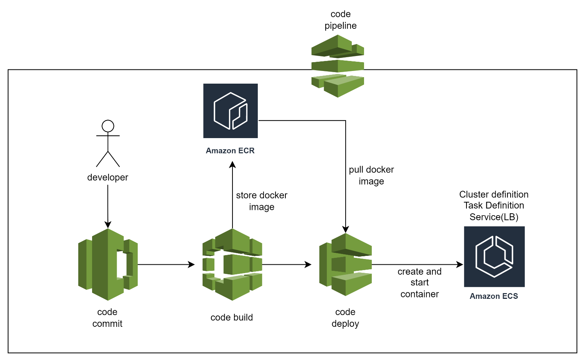
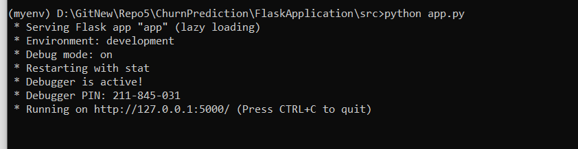
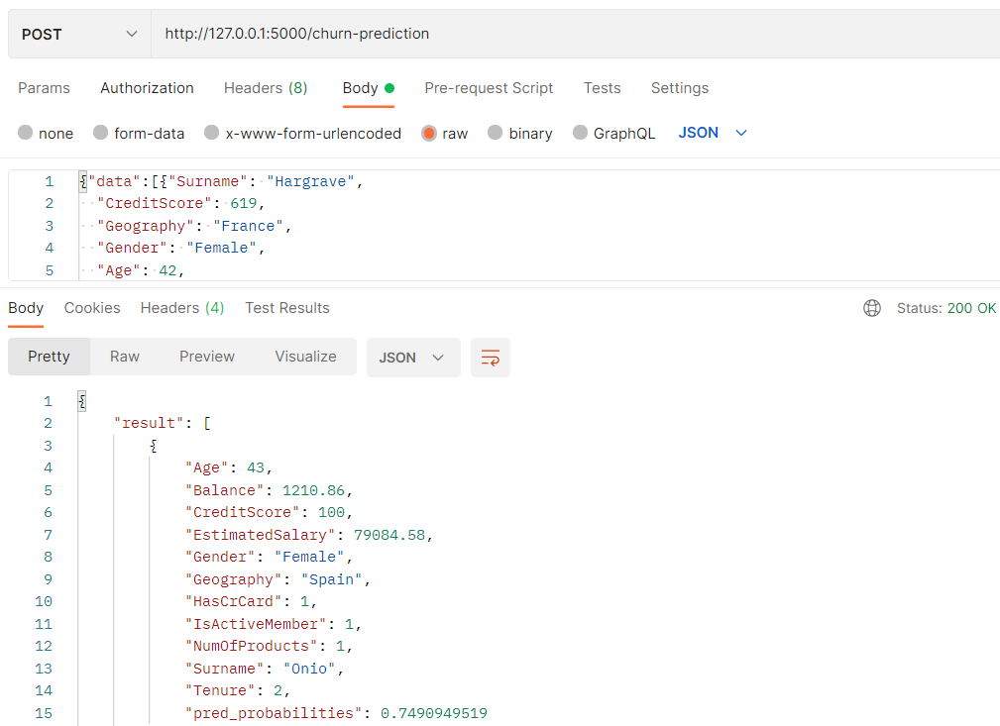
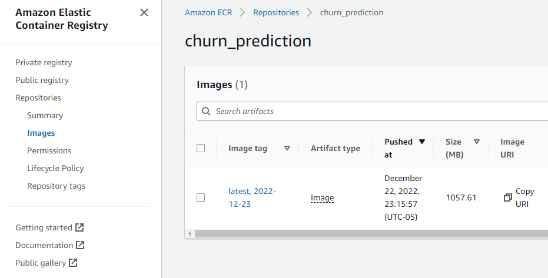
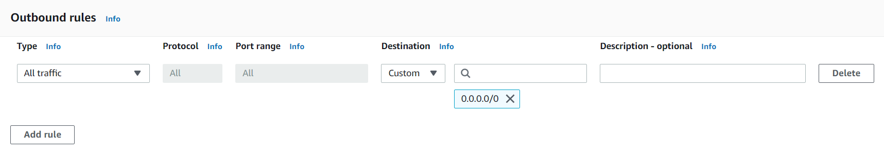
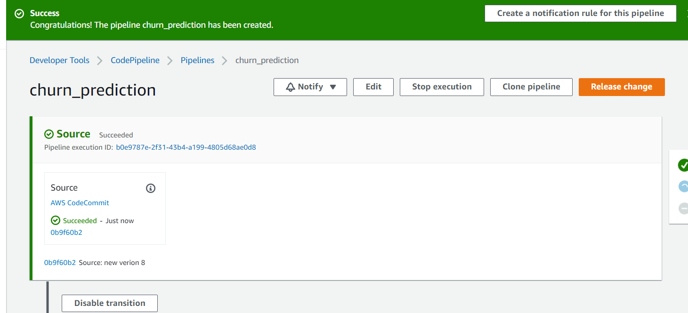

# **ML Model Deployment on AWS for Customer Churn Prediction**

## **Objective**

To deploy a model on AWS which predicts whether the customer is going to churn in the near future or not.

## **Tech Stack**

➔ Language: Python

➔ Libraries: Flask, gunicorn

➔ Services: Flask, Docker, AWS, Gunicorn

## **AWS Services**

-   AWS s3
-   Aws ECR
-   AWS ECS
-   AWS EC2 Load balancer
-   AWS Code commit
-   AWS Code Build
-   AWS Code Deploy
-   AWS Code Pipeline

<h2 style="text-align: center">Step - 1</h2>

<kbd></kbd>

<h2 style="text-align: center">Step - 2</h2>

<kbd></kbd>

<h2 style="text-align: center">Step - 3</h2>

<kbd></kbd>

## 1.  Create Flask Application
-  Save all the custom transformer classes – We have created transformer classes for **categorical encoding, adding features and custom scaler**. To do all the transformation of the test dataset we need to save these classes. It is saved under ML_Pipiline folder. https://github.com/AkashSDE/ChurnPrediction/tree/main/FlaskApplication/src/ML_Pipeline
-  Run engine.py https://github.com/AkashSDE/ChurnPrediction/blob/main/FlaskApplication/src/Engine.py file which will take the training dataset and train the best model with best configuration. It will the save the model in the output folder https://github.com/AkashSDE/ChurnPrediction/tree/main/FlaskApplication/output
-  Create app.py https://github.com/AkashSDE/ChurnPrediction/blob/main/FlaskApplication/src/app.py file which is the flask application with two routes /health-status and /churn-prediction. Exposed port is 5000.

<kbd><kbd>

- **predictor.py** – load the saved model, calculate the prediction, and return the results

   https://github.com/AkashSDE/ChurnPrediction/blob/main/FlaskApplication/src/predictor.py

-  Run the flask application and verify the two routes using postman.

<kbd></kbd>

<kbd></kbd>

    Json data

    {"data":[{"Surname": "Hargrave",

    "CreditScore": 619,

    "Geography": "France",

    "Gender": "Female",

    "Age": 42,

    "Tenure": 2,

    "Balance": 0.0,

    "NumOfProducts": 1,

    "HasCrCard": 1,

    "IsActiveMember": 1,

    "EstimatedSalary": 101348.88},

    {"Surname": "Onio",

    "CreditScore": 100,

    "Geography": "Spain",

    "Gender": "Female",

    "Age": 43,

    "Tenure": 2,

    "Balance": 1210.86,

    "NumOfProducts": 1,

    "HasCrCard": 1,

    "IsActiveMember": 1,

    "EstimatedSalary": 79084.58}

    ]

    }

## 2.  **Dockerize** the Flask application – Test before deploying to AWS
-  Create the list of libraries along with the version and save it as requirement.txt\<https://github.com/AkashSDE/ChurnPrediction/blob/main/FlaskApplication/requirements.txt\>

<kbd></kbd>

-  Create gunicorn.sh\<https://github.com/AkashSDE/ChurnPrediction/blob/main/FlaskApplication/src/gunicorn.sh\> file to configure the flask application with WSGI sever as Flask application should not be run directly in the production server

<kbd></kbd>

-  Create docker file - https://github.com/AkashSDE/ChurnPrediction/blob/main/Dockerfile

<kbd></kbd>

-  Build docker image and test the two routes again using postman client tool
-   Go to the folder where u kept the docker file and run the below command

    *\$ docker build -t churn-application .*

-   This will create an image churn-application check using docker images command
-   Run the below command to start the container

    *\$ Docker run -it -p 5000:5000 churn-application*

-   Go to postman client and test the two end points
## 3.  Create Code Commit Repo in AWS
-  Create Code commit repository with name – **churn_prediction**

<kbd></kbd>

<kbd></kbd>

-  The repository we created is a private repository. To connect with this repository, we need to create credentials.

    Go to IAM service click user select user select Security Credentials tab

    Scroll down to HTTPS Git credentials for AWS CodeCommit and click on generate credentials

    

<kbd></kbd>

    Create new credentials and download the credentials – get username and password in the csv file

-  Clone the repository in local

    Copy the HTTPS URL
    

<kbd></kbd>

    In the local CLI run the below command

    \$ *git clone \<URL\>*

    it will ask for username and password which you can get from csv file which is downloaded in step b.

-  Copy all the files and folder (exclude img folder and Readme file) from the below url to your local repository folder
    

<kbd></kbd>

[**https://github.com/AkashSDE/ChurnPrediction**](https://github.com/AkashSDE/ChurnPrediction)

-  Do git commit and git push to the aws code repository
-  Create testbranch and push all the changes to test branch as well

    We will use this testbranch to deploy and create pipeline

    

<kbd></kbd>

## 4.  AWS Code build project creation
-  Go to AWS console and search for **code build projects** click on **create build** projects

    Provide the below configuration

<kbd></kbd>

<kbd></kbd>

<kbd></kbd>

<kbd></kbd>

<kbd></kbd>

<kbd></kbd>

<kbd></kbd>

<kbd></kbd>

<kbd></kbd>

    Click on create build project

-  Create buildspec.yaml file

    This yaml file contains steps to be done for building the docker image and then pushing the docker image to ecr repository

    <https://github.com/AkashSDE/ChurnPrediction/blob/main/buildspec.yaml>

<kbd></kbd>

replace AccountId with your AWS account ID

## 5.  Create ECR repository 

ECR repository is like docker hub which is used to store the docker image built at code build stage.

Search Elastic container repository in the aws console Click Create Repository and provide below configuration

<kbd></kbd>

<kbd></kbd>

Go to code build service and click on start build

<kbd></kbd>

Click tail logs to see the progress

After build is successful, we can see the docker image got created inside ecr repository

<kbd></kbd>

## 6.  ECS cluster Definition

Search for elastic container service in aws console Click on **Clusters** in the left panel and then click on **Create Cluster** select cluster template **Networking only**  provide cluster name as **churn-cluster** and click on **create**

<kbd></kbd>

<kbd></kbd>

<kbd></kbd>

**New cluster is created**

## 7.  ECS Task definition

We need to create the task definition to run containers on the cluster that is created in the above steps.

<kbd></kbd>

<kbd></kbd>

<kbd></kbd>

**ecsTaskExecutionRole definition**

<kbd></kbd>

<kbd></kbd>

<kbd></kbd>

**Continue task definition**

<kbd></kbd>

Click on add container

<kbd></kbd>

Leave other fields blank

<kbd></kbd>

Click on create

<kbd></kbd>

**New Task definition churn is created**

## 8.  ECS service creation

    Deploy Task definition into cluster

    Create services which allow us to attach load balancer to container and we can access container client using load balancer.

    We can create as many tasks as possible which is contains a container

    First, we need to create load balancer then we can create Services in ECS

## 9.  Create a Load balancer
-   Create security group

<kbd></kbd>

<kbd></kbd>

<kbd></kbd>

-   Create Target groups

<kbd></kbd>

<kbd></kbd>

<kbd></kbd>

Click next and click **Create target group**

-   Create Load balancer

Select Application Load Balancer

<kbd></kbd>

<kbd></kbd>

<kbd></kbd>

<kbd></kbd>

<kbd></kbd>

<kbd></kbd>

Click on Create load balancer

-  Now go to aws console and search for ECS click on clusters

Click on churn-cluster select Services tab click on create

Configure service as shown in the figure below

<kbd></kbd>

<kbd></kbd>

<kbd></kbd>

    

**ecsCodeDeployRole details**

<kbd></kbd>

  

<kbd></kbd>

Click on **next step**

<kbd></kbd>

 

<kbd></kbd>

<kbd></kbd>

    

<kbd></kbd>

 

<kbd></kbd>

  

<kbd></kbd>

 
Click on next step

<kbd></kbd>

  
click on next step

Review all the details and click on create Service

<kbd></kbd>

Under Tasks Tab we can see our task definition running

<kbd></kbd>

Using postman client check if the two routes are working or not – use the LB DNS name

<kbd></kbd>

<kbd></kbd>

## 9.  Code deploy service

Go to aws console search code deploy service click on applications

Creating ecs service automatically creates an application for us in code deploy service

<kbd></kbd>

   

We can create multiple deployment groups

<kbd></kbd>

   
First, we will deploy the already created deployment group

Click on the deployment group

<kbd></kbd>

 
Click on create deployment

<kbd></kbd>

   
Appspec editor apspec yaml we need to provide the task definition details so that aws knows where to deploy the deployment groups

Find appspec.yaml github url

Copy the task definition arn from the json details of task definition

<kbd></kbd>

   

<kbd></kbd>

  

<kbd></kbd>

  

<kbd></kbd>

  

Click on create deployment

We will see the deployment status

<kbd></kbd>

  

<kbd></kbd>

    

In the ecs task we can see the two task once the new task comes up other task will go down

<kbd></kbd>

    

<kbd></kbd>

    
Once the replacement is 100% ready, we can click the terminate original task set

<kbd></kbd>

    

## 10.  Code Pipeline

Now we will create code pipeline so for every commit the code pipeline gets triggered and new version of application is deployed.

Open code pipeline service from aws console

<kbd></kbd>

First create the taskdef.json file and commit it in the code repo

Copy the task definition details from the json tab and paste it in taskdef.json file

<kbd></kbd>

Replace the image name with \<IMAGE_NAME\> tag

<kbd></kbd>

<kbd></kbd>

Remove the version from the task definition Arn

<kbd></kbd>

<kbd></kbd>

Do the above changes and push the taskdef.json in the aws code repository

Click on create pipeline

<kbd></kbd>

<kbd></kbd>

Click next

<kbd></kbd>

<kbd></kbd>

Click next

<kbd></kbd>

<kbd></kbd>

Click next

<kbd></kbd>

<kbd></kbd>

Click on next

<kbd></kbd>

<kbd></kbd>

<kbd></kbd>

<kbd></kbd>

Click on create pipeline

It gets automatically triggered

<kbd></kbd>

<kbd></kbd>

On every commit to the code repo the pipeline gets automatically triggered and new code is deploy using blue-green deployment strategy.
