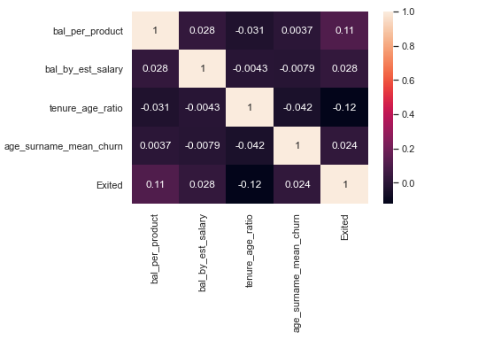
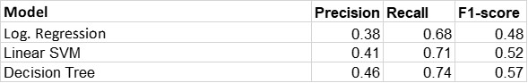
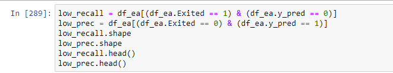

# **Customer Churn Prediction**

## **1. Problem Statement**

Over the last few quarters, Bank XYZ has seen a significant number of clients close their accounts or migrate to other institutions. As a result, quarterly revenues have suffered significantly and yearly revenues for the current fiscal year may suffer significantly, leading stocks to fall and market cap to fall by X%.

### **Objective:** Can we construct a model that predicts consumers who will churn in the near future with reasonable accuracy?

### **Definition of churn:** A customer having closed all their active accounts with the bank is said to have churned. Churn can be defined in other ways as well, based on the context of the problem. A customer not transacting for 6 months or 1 year can also be defined as to have churned, based on the business requirements

### Mapping the real-world problem to an ML problem

#### **2.1. Type of Machine Learning Problem**

It is a **binary classification problem**, for a given data of customer we need to predict if a customer churns or not

#### **2.2. Performance Metric**

Metric(s):

-   **Business metrics**: Churn rate (month-on-month, weekly/quarterly), Trend of avg. number of products per customer, %age of dormant customers, Other such descriptive metrics
-   **Data-related metrics** : F1-score, Recall, Precision

    Recall = TP/ (TP + FN)

    Precision = TP/ (TP + FP)

    F1-score = Harmonic mean of Recall and Precision

    where, TP = True Positive, FP = False Positive and FN = False Negative

1.  **Setting the target/goal for the metrics?**
-   ML-related metrics:
    -   Recall: \>70%
    -   Precision: \>70%
    -   F1-score: \>70%
-   Business metrics: Usually, it's top down. But a good practice is to consider it to make at least half the impact of the data science metric. For e.g., If we take Recall target as **70%** which means correctly identifying 70% of customers who's going to churn in the near future, we can expect that due to business intervention (offers, getting in touch with customers etc.), 50% of the customers can be saved from being churned, which means at least a **35%** improvement in Churn Rate
1.  Dataset Description

Dataset download link - <https://s3.amazonaws.com/hackerday.datascience/360/Churn_Modelling.csv>

**Target column – Exited (0/1)**

**Steps performed**

-   Basic Exploratory data analysis
-   Featurization
-   Feature Engineering
-   Baseline model development
-   Spot checking various ML algorithm and automations
-   Hyperparameter Tuning of the best ML model
-   Error analysis of the predicted output from the best ML model
-   Train Final Best Model and save the model
-   Load saved Model and Test it for unseen data
-   Create list of customers who are most likely to churn
### A.  **Basic Exploratory data analysis**
-   **Univariate analysis**

    
– Box plot and PDF of the numerical feature are analyzed

    
  

    
– Count plot for categorical features

    
  

-   **Bivariate analysis**

    – Analysis of correlations of Numerical feature with target variables.

    
  

    – Association of categorical features with target variables.

    
  

-   **Missing Value and Outlier Treatment**

    
  

-   No missing value
-   Based on Univariate analysis outlier treatment is not required
### B. **Featurization and Feature Encoding**

### **Categorical Feature**

As a rule of thumb, we can consider using:

1.  **Label Encoding** ---\> Binary categorical variables and Ordinal variables
2.  **One-Hot Encoding** ---\> non-ordinal categorical variables with low to mid cardinality (\< 5-10 levels)
3.  **Target encoding** ---\> Categorical variables with \> 10 levels
-   HasCrCard and IsActiveMember are already label encoded
-   For Gender, a simple Label encoding should be fine.
-   For Geography, since there are 3 levels, OneHotEncoding should do the trick
-   For Surname, we'll try Target/Frequency Encoding
### **Numerical Feature**

- Feature Scaling and Normalization can be performed for algorithms like Logistics regression and SVM. It is not required for Tree-based Models

### C.  **Feature Engineering**
Created some new features based on simple interactions between the existing features.

-   Balance/NumOfProducts
-   Balance/EstimatedSalary
-   Tenure/Age
-   Age \* Surname_enc

Linear association of new columns with target variables to judge importance can be seen from heatmap below:

  

  

### D. **Feature Selection**

Features shortlisted through EDA/manual inspection and bivariate analysis:

**Age, Gender, Balance, NumOfProducts, IsActiveMember, the 3 country/Geography variables, bal per product, tenure age ratio**

Using **RFE (Recursive Feature Elimination)** to check whether it gives us the same list of features, other extra features or lesser number of features

**RFE using Logistic Regression Model – Important Features**

  

**RFE using Decision Tree Model – Important Features**

  

### E.  **Baseline model Results**

  

**Tree-based model performed best**

**Decision tree rule engine visualization**

   
  

### F. **Spot – Checking Various ML Algorithms**
<b> steps<b>

-   Automate data preparation and model run through Pipelines – Created class for automating Categorical encoding, Adding Feature and Custom Scaler
-   Model Zoo: List of all models to compare/spot-check

    
  

-   Evaluate using k-fold Cross validation framework – Used 5 fold cross validation and optimize for recall as well as f1-score metric.

**Result of spot checking**

  

**LightGBM is chosen for further hyperparameter tuning because it has the best performance on recall metric, and it came close second when comparing using F1-scores.**

### G.  **Hyperparameter Tuning of the best Model – LGBM**
-   Used step wise grid search CV to find the best parameter
-   Final set of parameters for the best model

  
  

-   **To handle class imbalance used class weight ratio to provide more weight to the minority class**
### H.  **Error Analysis**

After getting the final LGBM model we can do the error analysis of the predictions made by the model on training dataset. This error analysis can help us to check if we made any incorrect assumptions. It also helps us to do data correction if it is required

-   Visualizing distribution of predicted probabilities vs true class

  
  

\# Ideally the separation should be there at 0.5 threshold

\# All the class 1 probability should be greater than 0.5

\# Less intersection implies less error

-   Revisiting bivariate plots of important features

    The difference in distribution of these features across the two classes help us to test a few hypotheses

    
  

    
  

    
  

-   **Extracting the subset of incorrect predictions**

    All incorrect predictions are extracted and categorized into false positives (low precision) and false negatives (low recall)

    
  

-   We can see the prob of errors and try to tune the threshold to avoid the errors e.g. in the low precision case we can see that prob is near to 0.53 or 0.502 so if we increase the threshold to 0.55 then We can make correct prediction and hence achieve high precision

    
  

    **\# Most of the prediction is between 0.3-0.4 for low recall errors**

   
  

   
   \# here most of the prob is 0.6 so if we shift the threshold to 0.6 then we may get high precision

**\# Seeing both the plots we are making lot of errors in 0.4-0.6 regions**

**\# if we just tune the threshold probably we can get better performance**

  

**\# Taking threshold as 0.45 gives the better result as compared to 0.5**

**\# Precision not decreased much and recall, and f1-score is increased as compared to 0.5**

**\# We can change the threshold only when we are very sure that data distribution won't change much, 0.5 is safe if we r not sure**

### I.   **Train final model and save model**

  

**Final model validation score**

  

### J.  **Load saved model and make predictions on unseen/future data**

Here, we'll use df_test as the unseen, future data

**Test Score**

  

### K. **Creating a list of customers who are the most likely to churn**

Listing customers who have a churn probability higher than 70%. These are the ones who can be targeted immediately

  

Got 124 customers who can leave the bank with more than 70% probability

Based on business requirements, a prioritization matrix can be defined, wherein certain segments of customers are targeted first. These segments can be defined based on insights through data or the business teams' requirements. E.g., Males who are an ActiveMember, have a CreditCard and are from Germany can be prioritized first because the business potentially sees the max. ROI from them.
